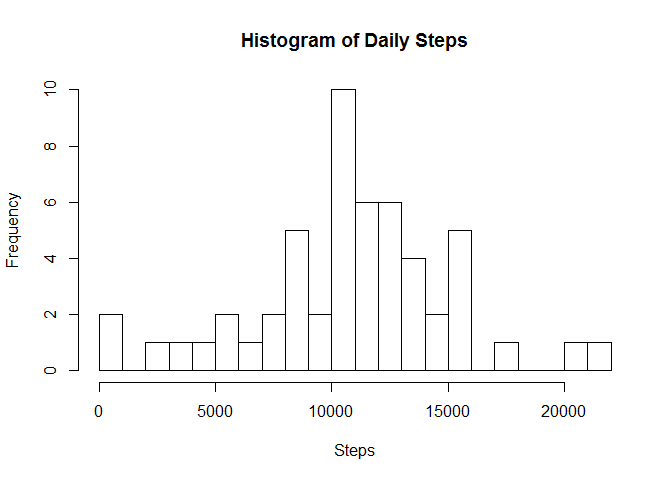
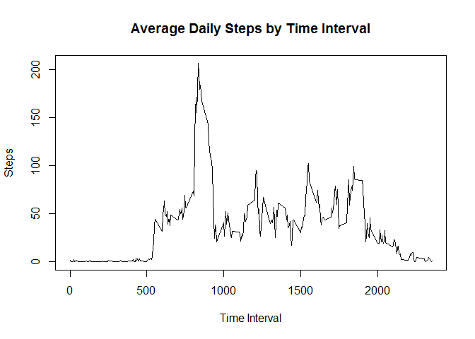
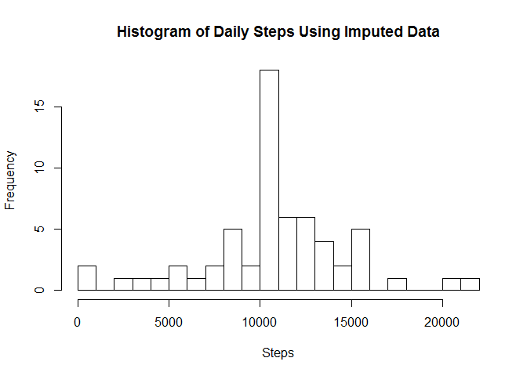
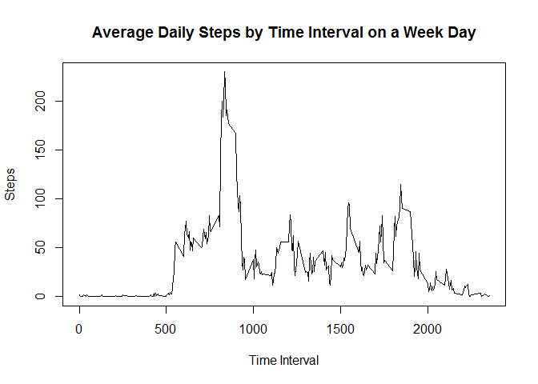
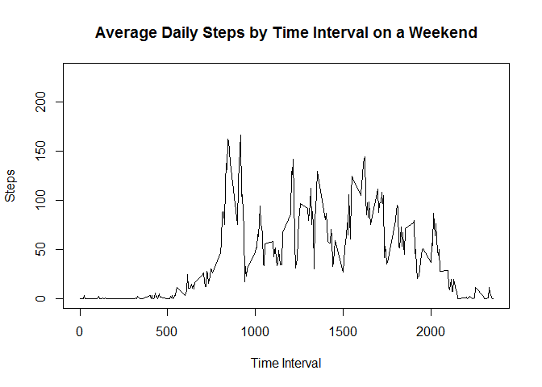

# Reproducible Research - Assignment 1
## Author: "Darren Wilkinson"
Document: "PA1_template.rmd"


```r
### Read the data
data <- read.csv("activity.csv", stringsAsFactors=FALSE)
data$date <- as.Date(data$date, "%Y-%m-%d")
library(dplyr)
```

```
## Warning: package 'dplyr' was built under R version 3.2.1
```

```
## 
## Attaching package: 'dplyr'
## 
## The following objects are masked from 'package:stats':
## 
##     filter, lag
## 
## The following objects are masked from 'package:base':
## 
##     intersect, setdiff, setequal, union
```

```r
daydata <- summarize(group_by(data, date), sum(steps))
names(daydata)[2]<-"steps"
### histogram data of daily steps
hist(daydata$steps, breaks=20,  main="Histogram of Daily Steps", xlab="Steps")
```

 

  The mean daily steps for the period is:

```r
mean(daydata$steps, na.rm=TRUE)
```

```
## [1] 10766.19
```

  The median daily steps for the period is:

```r
median(daydata$steps, na.rm=TRUE)
```

```
## [1] 10765
```

The average daily activity pattern for each 5 minute interval over the time period.


```r
datacleaned <- data[complete.cases(data),]
intervaldata <- summarize(group_by(datacleaned, interval), mean(steps))
names(intervaldata)[2]<-"steps"
plot(intervaldata$interval, intervaldata$steps,type="l",xlab="Time Interval", ylab="Steps", main="Average Daily Steps by Time Interval")
```

 
    
  There are a significant number of missing data in this data set. 

```r
sum(!complete.cases(data))
```

```
## [1] 2304
```
  This represents the following percentage of information.

```r
sum(!complete.cases(data))/nrow(data)
```

```
## [1] 0.1311475
```
  The following steps transform the missing values into mean values across the whole sample for the relevant 5 minute time interval.

```r
gaps <- data[!complete.cases(data),]
complete <- data[complete.cases(data),]
gaps <- data.frame(gaps, row.names=NULL)
gaps$steps <- intervaldata$steps[match(gaps$interval,intervaldata$interval)]
imputeddata <- rbind(complete, gaps)
imputeddata <- data.frame(imputeddata, row.names=NULL)
### histogram data of daily steps
daydataimputed <- summarize(group_by(imputeddata, date), sum(steps))
names(daydataimputed)[2]<-"steps"
hist(daydataimputed$steps, breaks=20,  main="Histogram of Daily Steps Using Imputed Data", xlab="Steps")
```

 
  
  The summary data for this new data set with the imputed data is:

```r
summary(daydataimputed$steps)
```

```
##    Min. 1st Qu.  Median    Mean 3rd Qu.    Max. 
##      41    9819   10770   10770   12810   21190
```

  For comparison, the summary information for the original data with missing data is:

```r
summary(daydata$steps, na.rm=TRUE)
```

```
##    Min. 1st Qu.  Median    Mean 3rd Qu.    Max.    NA's 
##      41    8841   10760   10770   13290   21190       8
```

  The mean of the imputed data set is the same and there has been a small change (increase) in the median, which is now equal to the mean. It is worth noting that the interquartile range (Q3-Q1) for the imputed data set has reduced. This can also be seen in the increased histogram frequency count around the mean values. We are obtaining this result as we are using mean values and therefore increasing the tendency of the distribution to cluster around the mean.

  The following data transformation maps the values into week day and weekend data for the 5 minute activity intervals. The plots for average daily steps for week days and weekends are shown below.

```r
impdatawithdays <- mutate(imputeddata, day=weekdays(imputeddata$date))
days <- c("Monday", "Tuesday", "Wednesday", "Thursday", "Friday", "Saturday", "Sunday")
class <- c("Weekday","Weekday","Weekday","Weekday","Weekday","Weekend","Weekend")
daymap <- data.frame(days,class)
daymapcol <- daymap$class[match(impdatawithdays$day,daymap$days)]
impdatawithdays <- cbind(impdatawithdays,daymapcol)
impintdata <- summarize(group_by(impdatawithdays, interval, daymapcol), mean(steps))
names(impintdata)[2]<-"day"
names(impintdata)[3]<-"steps"
weekday <- impintdata[which(impintdata$day=="Weekday"),]
weekend <- impintdata[which(impintdata$day=="Weekend"),] 

plot(weekday$interval, weekday$steps,type="l",
     xlab="Time Interval", 
     ylab="Steps", 
     main="Average Daily Steps by Time Interval on a Week Day",
      ylim=c(0, max(weekday$steps,weekend$steps)),
     )
```

 

```r
plot(weekend$interval, weekend$steps,type="l",
     xlab="Time Interval", 
     ylab="Steps", 
     main="Average Daily Steps by Time Interval on a Weekend",
     ylim=c(0, max(weekday$steps,weekend$steps))
     )
```

 
    
  The following tables compare the summary statistics of steps for both weekdays and weekends for each 5 minute interval.

```r
summary(weekday$steps)
```

```
##    Min. 1st Qu.  Median    Mean 3rd Qu.    Max. 
##   0.000   2.247  25.800  35.610  50.850 230.400
```

```r
summary(weekend$steps)
```

```
##    Min. 1st Qu.  Median    Mean 3rd Qu.    Max. 
##   0.000   1.241  32.340  42.370  74.650 166.600
```
  Despite weekdays having the largest value for steps in an interval, activity is higher at weekends. This is demonstrated with higher means and medians. The activity is also more evenly spread throughout the day (wider interquartile range).


